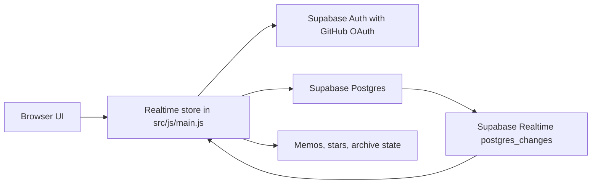

# Junle Chen · Research Homepage

A personal research workspace for notes, short thoughts, and papers worth reading.

**[Visit the site](https://junle-chen.github.io/)** · [中文说明](README.zh_CN.md) · [Report an issue](https://github.com/junle-chen/junle-chen.github.io/issues)

[](https://github.com/junle-chen/junle-chen.github.io/actions/workflows/publish-site.yml)
[](LICENSE)

## Explore the site

| Section | What you can do |
| --- | --- |
| **About Me** | Read my profile, research interests, selected work, and contact links. |
| **Blog / Notes** | Browse and search Markdown notes by category; read them with an outline, images, math rendering, and comments. |
| **Memos** | Follow a timeline of short updates and links. The site owner can sign in with GitHub to manage entries. |
| **Academic → Daily Paper** | Explore a curated arXiv reading feed with summaries, detailed notes, and paper links. |
| **Academic → Paper List** | Browse a longer-term list populated from a Zotero export. |

Paper stars and note archive state can sync across sessions through Supabase. Public reading does not require sign-in.

## A look inside

| Profile and entry points | Notes reader |
| --- | --- |
|  |  |
| **Memos** | **Academic** |
|  |  |

## Develop locally

Requires Node.js and npm. The deployment workflow uses Node.js 24; this repository has no npm lockfile.

```bash
npm install --no-package-lock --no-audit --no-fund
npm run build
npm run dev
```

`npm run build` generates `dist/`. `npm run dev` starts the gulp watcher and previews from `dist`.

## Where to edit

The files below are the main editing points for this website:

| File or folder | What to change |
| --- | --- |
| `config.json` | Page title, description, intro text, avatar, profile links, and WebGL background switch. |
| `src/assets/avatar.png` | Replace with your own avatar. |
| `src/assets/content/pages/aboutme.md` | About page content. |
| `src/assets/content/notes/` | Long-form Markdown notes. |
| `src/assets/content/data/daily-papers.json` | Daily Paper data. |
| `src/assets/content/data/zotero-paper-list.json` | Paper List data. |
| `src/js/realtime-config.js` | Supabase public config and owner GitHub identity. |
| `supabase/homepage-realtime.sql` | Supabase tables, RLS policies, owner checks, and realtime publication. |
| `src/js/main.js` | Giscus config and frontend interaction logic. |

## Services and integrations

| Integration | Required? | Purpose |
| --- | --- | --- |
| Supabase | Optional | Shared realtime memos, paper stars, Zotero stars, and note archive state. |
| GitHub OAuth | Optional | Owner login for write permissions through Supabase Auth. |
| Giscus | Optional | GitHub Discussions comments for notes. |
| GitHub Pages | Yes | Static hosting at the root GitHub Pages URL. |
| Zotero export | Optional | Populate the long-term Paper List view. |

<details>
<summary><strong>Implementation details: realtime state, owner login, and comments</strong></summary>

## Realtime architecture

The site is statically hosted. Dynamic state is handled by Supabase Auth, Supabase Postgres, and Supabase Realtime:



### Frontend Entry Points

| File | Role |
| --- | --- |
| `src/components/scripts.pug` | Loads `@supabase/supabase-js@2`, `js/realtime-config.js`, and `js/main.js`. |
| `src/js/realtime-config.js` | Stores the public Supabase URL, anon key, owner GitHub ids/logins, and OAuth redirect URL. |
| `src/js/main.js` | Creates the realtime store, exposes the frontend realtime API, and updates UI modules through events. |

### Supabase Tables

The full schema is in `supabase/homepage-realtime.sql`.

| Table | Purpose |
| --- | --- |
| `site_memos` | Stores timeline memos with title, content, category, priority, source, owner id, timestamps, and a soft-delete field. |
| `site_reactions` | Stores shared state for `daily_paper`, `zotero_paper`, and `note_archive` items. |

`site_reactions` uses `unique (item_type, item_key)`, so each paper or note has one stable state row.

### Auth And RLS

Supabase uses GitHub OAuth for owner login. The SQL helper `public.is_homepage_owner()` checks GitHub identity values from the Supabase JWT. Configure your own owner ids and logins in both:

- `src/js/realtime-config.js`
- `supabase/homepage-realtime.sql`

The intended Row Level Security behavior is:

- visitors can read published memos and reactions
- only configured owners can insert, update, or delete memos
- only configured owners can insert, update, or delete reactions

The Supabase anon key can be public in frontend code because writes are controlled by Auth and RLS. Keep GitHub OAuth client secrets, deployment tokens, and other private credentials outside the repository.

### Realtime Subscriptions

The frontend subscribes to Supabase `postgres_changes` events:

| Channel target | UI behavior |
| --- | --- |
| `site_memos` | Reloads the memo timeline after insert, update, or delete events. |
| `site_reactions` + `daily_paper` | Syncs Daily Paper stars. |
| `site_reactions` + `zotero_paper` | Syncs Paper List stars. |
| `site_reactions` + `note_archive` | Syncs archived note state. |

When one signed-in owner updates a memo or star, other open browser sessions receive a realtime event and reload the current state.

### Local Fallback

If Supabase is not configured, the network is unavailable, or the visitor is not signed in:

- the static site still loads normally
- public content remains readable
- write actions become read-only or fall back to local `localStorage` state
- the UI can show `Local mode`, `Live read-only`, `Signed in read-only`, or `Live owner`

## 🧩 Configure Supabase

1. Create a Supabase project.
2. Copy the Project URL and publishable anon key.
3. Run `supabase/homepage-realtime.sql` in the Supabase SQL Editor.
4. Enable GitHub in Supabase Authentication Providers.
5. Create a GitHub OAuth App with this callback URL:

```text
https://<project-ref>.supabase.co/auth/v1/callback
```

6. Put the GitHub Client ID and Client Secret into the Supabase GitHub provider settings.
7. Update `src/js/realtime-config.js`:

```js
window.JUNLE_REALTIME_CONFIG = {
	supabaseUrl: "https://<project-ref>.supabase.co",
	supabaseAnonKey: "<publishable-anon-key>",
	ownerGithubIds: ["<github-numeric-id>"],
	ownerGithubLogins: ["<github-login>"],
	redirectTo: window.location.origin + window.location.pathname,
};
```

8. Update the allowed owner ids/logins in `supabase/homepage-realtime.sql` before running it.

## 💭 Configure Giscus

Giscus uses GitHub Discussions as the comment backend. The config lives in `GISCUS_CONFIG` inside `src/js/main.js`.

Required setup:

1. Enable GitHub Discussions for your repository.
2. Install and authorize the Giscus GitHub App for your repository.
3. Use [giscus.app](https://giscus.app/) to generate:
   - `data-repo`
   - `data-repo-id`
   - `data-category`
   - `data-category-id`
4. Paste those values into `GISCUS_CONFIG`.

Each note uses its own `data-comment-term`, so every note gets a separate discussion thread.
The current site keeps its existing Giscus discussions in `junle-chen/ac-homepage` so
existing comment threads remain available; changing that backend is a separate migration.

</details>

## Publish the site

This repository is the primary source for [https://junle-chen.github.io](https://junle-chen.github.io).
Its [GitHub Actions workflow](.github/workflows/publish-site.yml) builds this repository's
`master` branch and publishes `dist/` directly to the root GitHub Pages URL.
The former Academic Pages website is preserved under [archive/academic-pages](archive/academic-pages/)
and is not included in the deployed artifact.

```bash
npm run build
# Commit and push the intended website changes to master to publish them.
```

The workflow rebuilds from committed source after each push to `master` and records the
deployed commit in `deployment-source.json`. Keep Daily Paper source and generated `dist`
data consistent before committing; the Daily Paper automation now runs from this repository.
Local uncommitted files are not included in the deployment.

The GitHub root website must have no custom domain configured, and `dist/CNAME` must not exist.
The former [ac-homepage](https://github.com/junle-chen/ac-homepage) repository retains only
the `junle.cc` GitHub Pages redirect on its `gh-pages` branch. Do not publish this site's
full `dist/` to that branch: it would replace the redirect.

Supabase Authentication URL Configuration:

- Site URL: `https://junle-chen.github.io`
- Redirect URL: `https://junle-chen.github.io/`

## Project structure

| Path | Description |
| --- | --- |
| `config.json` | Homepage config and profile links. |
| `src/components/` | Pug templates. |
| `src/css/` | LESS styles. |
| `src/js/main.js` | Page interactions, note reader, Giscus, and realtime store. |
| `src/js/realtime-config.js` | Public Supabase config. |
| `src/assets/content/notes/` | Long-form Markdown notes. |
| `src/assets/content/pages/` | In-site Markdown pages. |
| `src/assets/content/data/daily-papers.json` | Daily Paper data. |
| `src/assets/content/data/zotero-paper-list.json` | Paper List data. |
| `supabase/homepage-realtime.sql` | Supabase schema, RLS policies, and realtime publication. |
| `dist/` | Generated static site. |

<details>
<summary><strong>Services and upstream projects</strong></summary>

## Websites and services used

| Website or project | Use |
| --- | --- |
| [GitHub Pages](https://pages.github.com/) | Static hosting at the root GitHub Pages URL. |
| [GitHub](https://github.com/) | Source hosting, Discussions, and OAuth App setup. |
| [Giscus](https://giscus.app/) | Comment widget powered by GitHub Discussions. |
| [Supabase](https://supabase.com/) | Realtime database, Auth, and owner-only writes. |
| [arXiv](https://arxiv.org/) | Paper metadata and paper links for Daily Paper and Paper List content. |
| [Zotero](https://www.zotero.org/) | Local paper-library export source. |
| [jsDelivr](https://www.jsdelivr.com/) | Runtime CDN for frontend libraries. |
| [Shields.io](https://shields.io/) | README badges. |
| [anime.js](https://animejs.com/) | Animation timing and transitions. |
| [MathJax](https://www.mathjax.org/) | LaTeX rendering for notes and paper details. |
| [Supabase JS](https://supabase.com/docs/reference/javascript/introduction) | Browser client for Auth and Realtime. |
| [Alibaba Iconfont](https://www.iconfont.cn/) | Icon font for link buttons. |
| [SimonAKing/HomePage](https://github.com/SimonAKing/HomePage) | Original homepage structure and intro style. |
| [WebGL Fluid Simulation](https://github.com/PavelDoGreat/WebGL-Fluid-Simulation/) | WebGL fluid background implementation. |
| [Beautiful Jekyll](https://github.com/daattali/beautiful-jekyll) | Historical imported notes-site assets. |
| [bootstrap-social](https://github.com/lipis/bootstrap-social) | Historical imported social-button CSS asset. |

</details>

## Maintainer, contributors, and license

Junle Chen maintains this website. Its code grew from [SimonAKing/HomePage](https://github.com/SimonAKing/HomePage). The current `master` branch begins with this site's present files, while the [previous commit history](https://github.com/junle-chen/junle-chen.github.io/tree/archive/master-history-before-cleanup) remains available on a separate branch. GitHub's **Contributors** panel counts the current default branch; earlier authors retain their original commits in the history branch. See [ATTRIBUTION.md](ATTRIBUTION.md) and [NOTICE.md](NOTICE.md) for upstream and third-party credits.

Reusable website code keeps the upstream [LGPL-3.0-only license](LICENSE). Personal site content has separate [content notes](CONTENT_LICENSE.md). Keep `LICENSE`, `NOTICE.md`, and `ATTRIBUTION.md` when redistributing the code.
