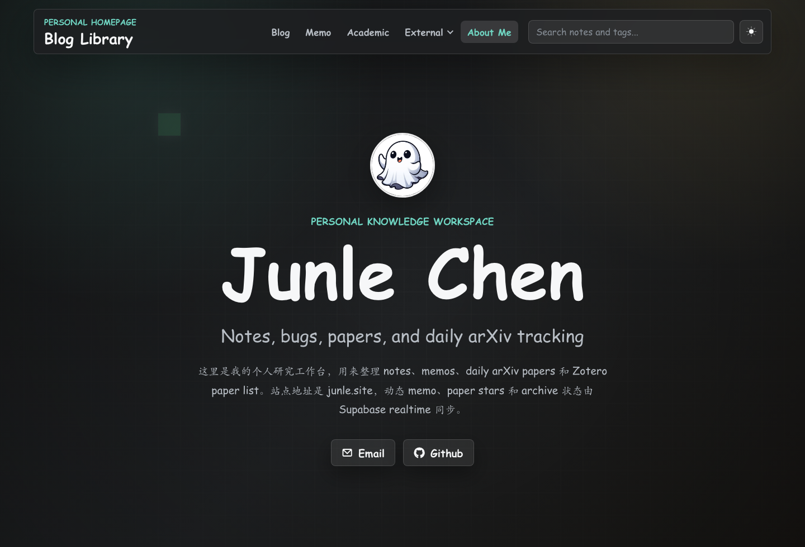
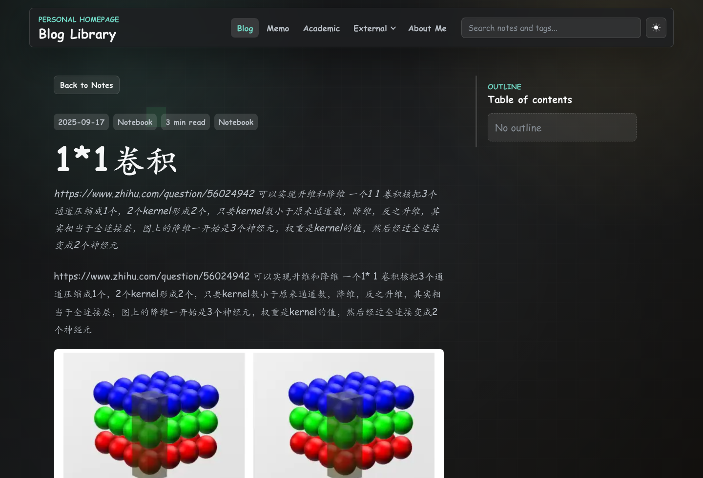
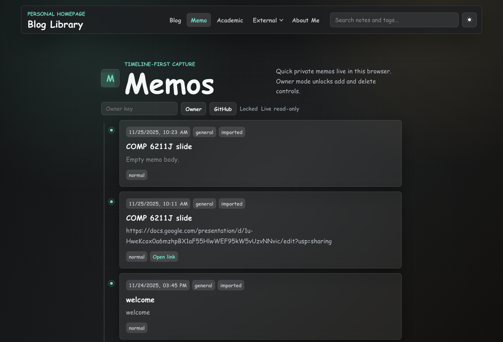
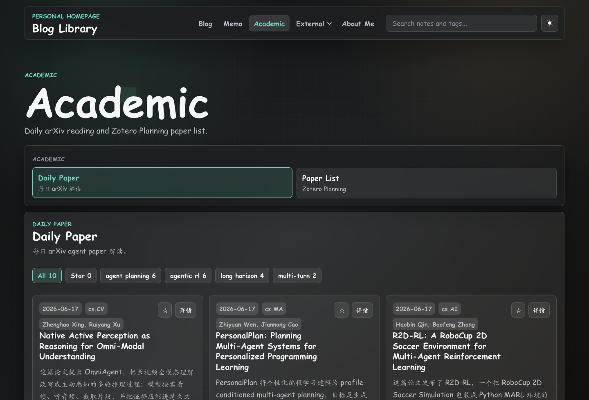

# Junle Chen · 研究主页

这里整理我的研究方向、技术笔记、随手记录和论文阅读。

**[访问网站](https://junle-chen.github.io/)** · [English](README.md) · [反馈问题](https://github.com/junle-chen/junle-chen.github.io/issues)

## 网站里有什么

| 栏目 | 功能 |
| --- | --- |
| **About Me** | 个人介绍、研究方向、部分成果与联系方式。 |
| **Blog / Notes** | 按分类浏览、搜索技术笔记；站内阅读支持目录、图片、公式和评论。 |
| **Saved Blogs** | 登录后只填 URL 就能私密收藏；新链接进入每日整理队列，也可随时手动编辑、筛选或调整分类。 |
| **Memos** | 按时间线阅读简短想法与链接；站长可通过 GitHub 登录管理。 |
| **Academic → Daily Paper** | 浏览精选 arXiv 论文、简要摘要、详细阅读记录与原文链接。 |
| **Academic → Paper List** | 浏览从 Zotero 导出的长期论文清单。 |

论文星标和笔记归档状态可通过 Supabase 跨会话同步；不登录也能阅读静态内容。Saved Blogs 数据只保存在 Supabase，不写入公开仓库或网站 JSON。

在 Saved Blogs 中只填 URL 并保存，会以 `待整理` 分类入队；每日 Codex 任务核对来源后补充标题、简短摘要和分类。你手动指定的分类不会被自动覆盖。详细字段仍可展开后自行修改。

## 页面预览

| 主页与个人介绍 | 站内笔记阅读 |
| --- | --- |
|  |  |
| **Memos** | **Academic** |
|  |  |

## 内容和实现

Pug、LESS 和 JavaScript 构建出静态网站，由 GitHub Pages 托管。Supabase 负责可选的实时 Memo 与交互状态；GitHub OAuth 将写入权限限定给配置的站长。笔记评论使用 Giscus。Daily Paper 和 Paper List 的数据保存在仓库中的 JSON 文件里。

| 修改内容 | 文件位置 |
| --- | --- |
| 主页文案和链接 | [config.json](config.json) |
| 个人介绍 | [aboutme.md](src/assets/content/pages/aboutme.md) |
| 技术笔记 | [notes/](src/assets/content/notes/) |
| Daily Paper | [daily-papers.json](src/assets/content/data/daily-papers.json) |
| Paper List | [zotero-paper-list.json](src/assets/content/data/zotero-paper-list.json) |
| 页面模板和样式 | [src/components/](src/components/) 与 [src/css/](src/css/) |
| 实时服务与站长配置 | [realtime-config.js](src/js/realtime-config.js) |
| 数据库结构和访问权限 | [homepage-realtime.sql](supabase/homepage-realtime.sql) |
| 私密收藏及权限 | [blog-bookmarks.sql](supabase/blog-bookmarks.sql) |
| 网页标题和摘要导入 | [blog-metadata](supabase/functions/blog-metadata/) |

## 本地运行

需要 Node.js 和 npm。发布工作流使用 Node.js 24；仓库目前没有 npm lockfile。

    npm install --no-package-lock --no-audit --no-fund
    npm run build
    npm run dev

构建结果位于 <code>dist/</code>；开发命令会启动监听与预览。投稿、内容校对和发布约定见 [CONTRIBUTING.md](CONTRIBUTING.md)。

## 发布与外部服务

本仓库的 <code>master</code> 分支是 [junle-chen.github.io](https://junle-chen.github.io/) 的**主编辑来源**。推送后，[GitHub Pages 工作流](.github/workflows/publish-site.yml)构建并发布 <code>dist/</code>。根网站不配置自定义域名 <code>CNAME</code>。<code>junle.cc</code> 的跳转页面仍由另一仓库的 <code>ac-homepage/gh-pages</code> 分支提供，不应将本站完整构建结果发布到那里。

旧的 Academic Pages 网站内容保存在 [archive/academic-pages](archive/academic-pages/)，不进入当前发布页面。

| 服务 | 作用 |
| --- | --- |
| [GitHub Pages](https://pages.github.com/) | 托管静态网站。 |
| [Supabase](https://supabase.com/) | 保存 Memo 和交互状态、处理站长登录与实时更新。 |
| [Giscus](https://giscus.app/) | 通过 GitHub Discussions 显示笔记评论；现有讨论仍保留在 <code>junle-chen/ac-homepage</code>。 |
| [arXiv](https://arxiv.org/) 与 [Zotero](https://www.zotero.org/) | 提供论文链接和文献库元数据。 |

前端的 Supabase 公共密钥可以公开；写权限由登录身份和 [SQL 中的 RLS 规则](supabase/homepage-realtime.sql)控制。OAuth 密钥和发布凭证不能提交到仓库。自行部署时，还需同时更新 SQL 与 [realtime-config.js](src/js/realtime-config.js) 中的站长身份，并在 Supabase 配置 GitHub 登录和允许的回调网址。Giscus 的仓库和分类 ID 位于 [main.js](src/js/main.js)。

Saved Blogs 使用单独的[数据表和 RLS](supabase/blog-bookmarks.sql)：只有指定 Supabase 用户 ID 能读取与修改，匿名用户没有表权限。自动导入标题与摘要由仅限站长调用的 Edge Function 完成；网页限制抓取时可手动填写。收藏不会复制网页全文。

## 维护者、贡献者与许可

本站由 Junle Chen 维护，代码最初基于 [SimonAKing/HomePage](https://github.com/SimonAKing/HomePage)。当前 `master` 从网站现有文件重新开始；[此前的完整提交历史](https://github.com/junle-chen/junle-chen.github.io/tree/archive/master-history-before-cleanup)保存在独立分支，原作者和提交记录没有被改写。GitHub 侧栏的 **Contributors** 按当前默认分支统计。上游和第三方来源见 [ATTRIBUTION.md](ATTRIBUTION.md) 与 [NOTICE.md](NOTICE.md)。

可复用代码沿用 [LGPL-3.0-only](LICENSE)；个人网站内容的说明见 [CONTENT_LICENSE.md](CONTENT_LICENSE.md)。
